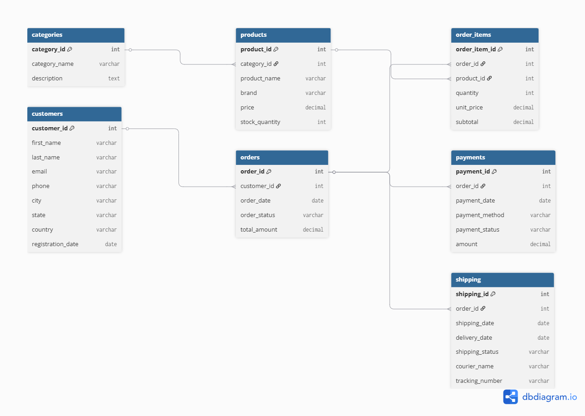
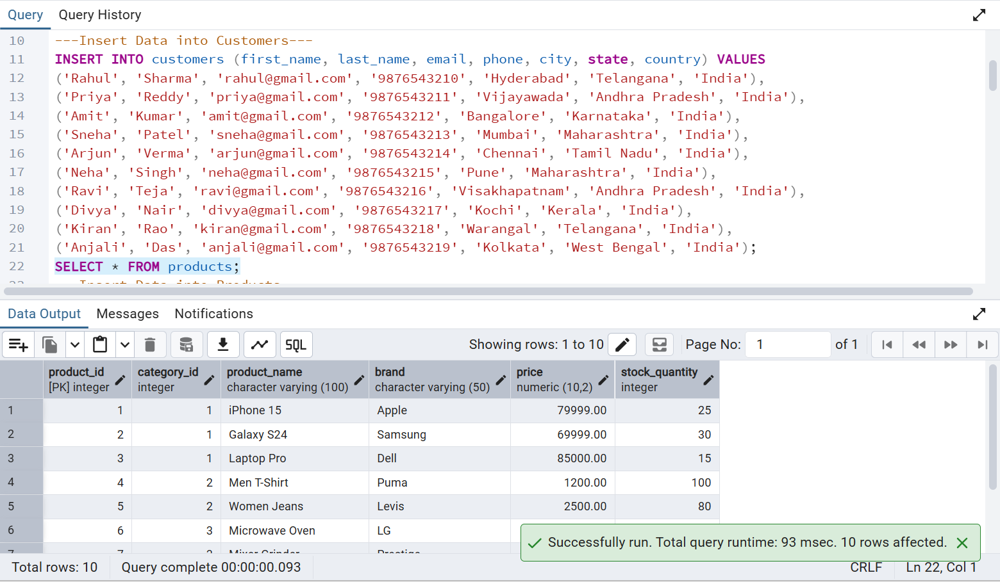
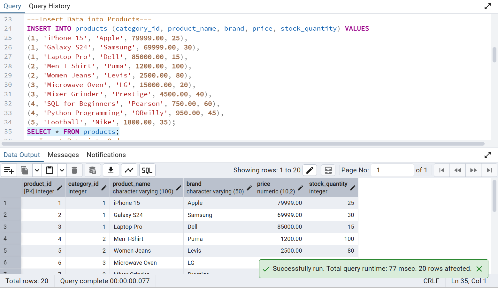
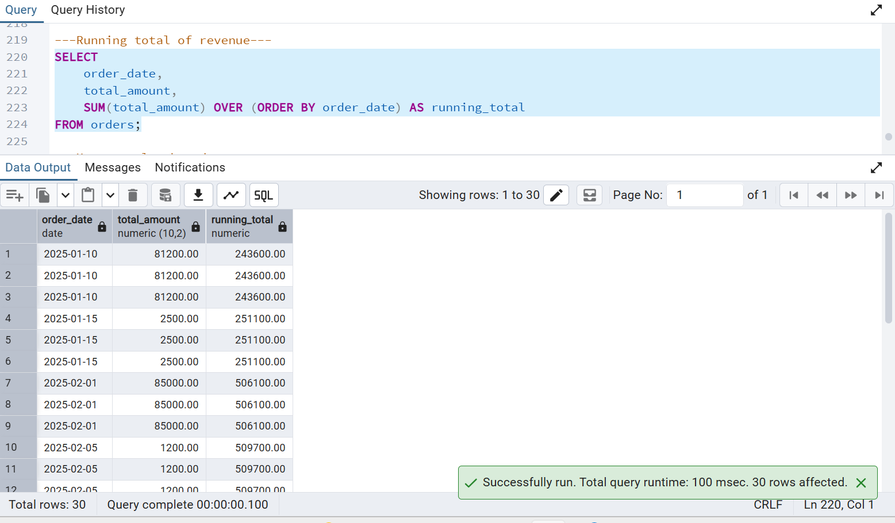
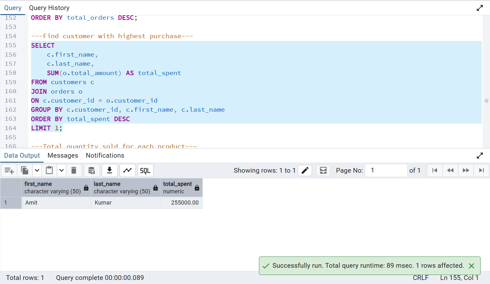

# 🛒 E-Commerce Sales Analytics using PostgreSQL

## 📌 Project Overview

The **E-Commerce Sales Analytics** project is a PostgreSQL-based database system designed to manage and analyze sales data for an online shopping platform. It demonstrates database design, SQL querying, data analysis, and business reporting using a relational database model.

This project includes:

* Database creation
* Table creation with relationships
* Sample data insertion
* Business-oriented SQL queries
* Entity Relationship (ER) Diagram
* Query result screenshots

It is an ideal portfolio project for **Data Analyst**, **SQL Developer**, and **Business Analyst** roles.

---

# 🎯 Objectives

* Design a normalized relational database.
* Store customer, product, order, payment, and shipping information.
* Analyze business performance using SQL.
* Generate meaningful insights from sales data.
* Demonstrate SQL concepts such as JOINs, GROUP BY, Aggregate Functions, and Window Functions.

---

# 🏗️ Database Schema

The project contains the following tables:

* 📂 Categories
* 👤 Customers
* 📦 Products
* 🛒 Orders
* 📋 Order Items
* 💳 Payments
* 🚚 Shipping

---

# 🔗 Entity Relationship Diagram



---

# 🛠️ Technologies Used

* PostgreSQL
* pgAdmin 4
* SQL
* dbdiagram.io
* GitHub

---

# 📂 Project Files

| File Name              | Description                 |
| ---------------------- | --------------------------- |
| `create_database.sql`  | Creates the database        |
| `create_tables.sql`    | Creates all tables          |
| `insert_data.sql`      | Inserts sample data         |
| `business_queries.sql` | Business analysis queries   |
| `er_diagram.png`       | Entity Relationship Diagram |

---

# 📊 Business Queries Implemented

The project includes professional SQL queries such as:

* Show all customers
* Show all products
* Show all categories
* Count total customers
* Count total orders
* Calculate total revenue
* Average order value
* Top customers by spending
* Sales by category
* Best-selling products
* Revenue by payment method
* Monthly sales report
* Orders by status
* Shipping status summary
* Customer purchase history
* Product stock analysis
* Running total revenue
* Customer ranking
* Complete order report
* Top categories by revenue

---

# 📸 Project Screenshots

## Customers Table



---

## Products Table



---

## Total Revenue Query



---

## Top Customers Query



---

## ER Diagram


---

# 🔄 Database Relationships

* One Category → Many Products
* One Customer → Many Orders
* One Order → Many Order Items
* One Product → Many Order Items
* One Order → One Payment
* One Order → One Shipping Record

---

# 🚀 How to Run

### Step 1

Create the database:

```sql
CREATE DATABASE ecommerce_sales_db;
```

### Step 2

Execute:

```
create_tables.sql
```

### Step 3

Execute:

```
insert_data.sql
```

### Step 4

Run:

```
business_queries.sql
```

### Step 5

Analyze the generated reports and insights.

---

# 📈 SQL Concepts Used

* SELECT
* WHERE
* ORDER BY
* GROUP BY
* HAVING
* INNER JOIN
* Aggregate Functions
* Window Functions
* SUM()
* AVG()
* COUNT()
* MAX()
* MIN()
* RANK()
* Foreign Keys
* Primary Keys

---

# 💡 Key Insights Generated

* Total Revenue
* Monthly Revenue
* Customer Spending
* Best Selling Products
* Category-wise Sales
* Revenue by Payment Method
* Product Stock Analysis
* Order Status Distribution
* Payment Status Summary
* Shipping Performance

---

# 📚 Learning Outcomes

This project demonstrates:

* Relational Database Design
* Data Modeling
* SQL Query Writing
* Business Analytics
* Reporting and Insights
* Database Normalization
* Foreign Key Relationships
* Real-world E-Commerce Data Analysis

---

# 👩‍💻 Author

**Kapa Sri Lakshmi**

Aspiring Data Analyst | SQL | PostgreSQL | Excel | Python

---

# ⭐ Project Highlights

✅ 7 Relational Tables

✅ Primary & Foreign Key Constraints

✅ Sample Business Dataset

✅ 30+ Professional SQL Queries

✅ ER Diagram

✅ Business Reports

✅ PostgreSQL Implementation

---

If you found this project useful, feel free to ⭐ star the repository and connect with me on LinkedIn.
